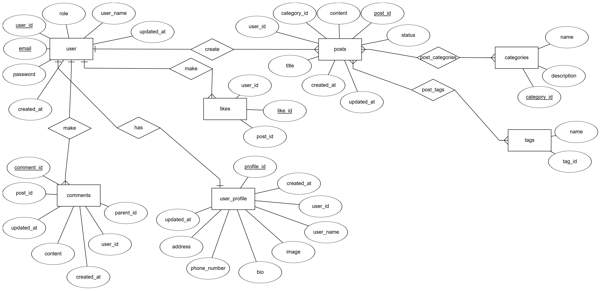

# 📊 DATABASE DESIGN – DevShare Lite

## 🧠 Design Objectives

The **DevShare Lite** database is designed to support a technical discussion and article-sharing forum where users can register accounts, write posts, tag content, leave comments, and categorize posts by topic. The system prioritizes scalability, query optimization, and data integrity.

---

## 🔗 Entity Relationship Diagram (ER Diagram - textual description)

**ER Diagram of DevShare Lite Database** 

---

## 📁 Table Details

### 1. `users` – Users

| Column Name | Data Type    | Constraints                | Description           |
| ----------- | ------------ | -------------------------- | --------------------- |
| user_id    | SERIAL       | PRIMARY KEY                 | User ID               |
| user_name  | VARCHAR(100) | NOT NULL                    | Display name          |
| email       | VARCHAR(255) | NOT NULL, UNIQUE           | Registered email      |
| password    | TEXT         | NOT NULL                   | Encrypted password    |
| role        | VARCHAR(50)  | NOT NULL, DEFAULT 'member' | Role: admin or member |
| created_at | TIMESTAMP    | DEFAULT CURRENT_TIMESTAMP   | Account creation time |
| updated_at | TIMESTAMP    | DEFAULT CURRENT_TIMESTAMP   | Last update time      |

---

### 2. `user_profile` – User Profile

| Column Name   | Data Type    | Constraints                       | Description           |
| ------------- | ------------ | --------------------------------- | --------------------- |
| user_id      | INT          | PRIMARY KEY, FK → users(user_id)   | User ID               |
| user_name    | VARCHAR(100) | NOT NULL                           | Display name          |
| image         | VARCHAR(255) | NULLABLE                          | Avatar URL            |
| bio           | TEXT         | NULLABLE                          | Short bio             |
| address       | VARCHAR(255) | NULLABLE                          | Address               |
| phone_number | VARCHAR(50)  | NULLABLE                           | Phone number          |
| created_at   | TIMESTAMP    | DEFAULT CURRENT_TIMESTAMP          | Profile creation date |
| updated_at   | TIMESTAMP    | DEFAULT CURRENT_TIMESTAMP          | Last update date      |

---

### 3. `categories` – Categories

| Column Name  | Data Type    | Constraints | Description                 |
| ------------ | ------------ | ----------- | --------------------------- |
| category_id  | SERIAL       | PRIMARY KEY | Category ID                 |
| name         | VARCHAR(100) |             | Category name               |
| description  | TEXT         |             | Description of the category |

---

### 4. `posts` – Posts

| Column Name  | Data Type    | Constraints                                       | Description      |
| ------------ | ------------ | ------------------------------------------------- | ---------------- |
| post_id      | SERIAL       | PRIMARY KEY                                       | Post ID          |
| user_id      | INT          | FK → users(user_id), ON DELETE SET NULL           | Author           |
| title        | VARCHAR(255) |                                                   | Post title       |
| content      | TEXT         |                                                   | Post content     |
| category_id  | INT          | FK → categories(category_id), ON DELETE SET NULL  | Main category    |
| status       | VARCHAR(50)  | CHECK (status IN ('draft', 'published'))          | Post status      |
| created_at   | TIMESTAMP    | DEFAULT CURRENT_TIMESTAMP                         | Creation date    |
| updated_at   | TIMESTAMP    | DEFAULT CURRENT_TIMESTAMP                         | Last update date |

---

### 5. `comments` – Comments

| Column Name | Data Type | Constraints                                   | Description                |
| ----------- | --------- | --------------------------------------------- | -------------------------- |
| comment_id  | SERIAL    | PRIMARY KEY                                   | Comment ID                 |
| post_id     | INT       | FK → posts(post_id), ON DELETE CASCADE        | Related post               |
| user_id     | INT       | FK → users(user_id), ON DELETE CASCADE        | Comment author             |
| content     | TEXT      |                                               | Comment content            |
| parent_id   | INT       | FK → comments(comment_id), ON DELETE CASCADE  | Parent comment ID (if any) |
| created_at  | TIMESTAMP | DEFAULT CURRENT_TIMESTAMP                     | Creation time              |
| updated_at  | TIMESTAMP | DEFAULT CURRENT_TIMESTAMP                     | Last update                |

---

### 6. `post_categories` – Post-Category Mapping (Many-to-Many)

| Column Name  | Data Type | Constraints                                | Description |
| ------------ | --------- | ------------------------------------------ | ----------- |
| post_id      | INT       | PRIMARY KEY, FK → posts(post_id)           | Post ID     |
| category_id  | INT       | PRIMARY KEY, FK → categories(category_id)  | Category ID |

*> Note*: `posts.category_id` is the **main** category; this table represents **additional related categories**.

---

### 7. `tags` – Tags

| Column Name | Data Type    | Constraints | Description |
| ----------- | ------------ | ----------- | ----------- |
| tag_id      | SERIAL       | PRIMARY KEY | Tag ID      |
| name        | VARCHAR(100) |             | Tag name    |

---

### 8. `post_tags` – Post-Tag Mapping (Many-to-Many)

| Column Name | Data Type | Constraints                       | Description |
| ----------- | --------- | --------------------------------- | ----------- |
| post_id     | INT       | PRIMARY KEY, FK → posts(post_id)  | Post ID     |
| tag_id      | INT       | PRIMARY KEY, FK → tags(tag_id)    | Tag ID      |

---

## ✅ Key Constraints

* **ON DELETE CASCADE**: Used for comments, posts, and user profiles to ensure dependent data is also deleted.
* **ON DELETE SET NULL**: Used in posts when a user or category is deleted, to prevent loss of main content.

---

## 🔄 Table Relationships (1-1, 1-N, N-N)

```
users           1 ────── 1 user_profile  
users           1 ──────< posts  
users           1 ──────< comments  
posts           1 ──────< comments  
comments        1 ──────< comments (self-reference)  
posts           N ──────< post_categories >────── N categories  
posts           N ──────< post_tags >────── N tags  
```

---

## 🚀 Future Enhancements

* Add a `likes` table to track user likes on posts and comments.
* Add a `notifications` table to manage user interactions.
* Add a `slug` field in `posts` for SEO-friendly URLs.

---

## 🧩 Why Use a Relational Database (PostgreSQL)?

DevShare Lite is built on the PostgreSQL relational database system for the following reasons:

* **Structured data**: Entities like users, posts, and categories have clearly defined relationships, making a relational model ideal.
* **Strong constraint support**: PostgreSQL supports robust features like foreign keys and cascading actions for data integrity.
* **Scalability and performance**: Indexing and a powerful query planner allow for efficient performance on medium to large-scale apps.
* **Transactional support (ACID)**: Data consistency is crucial in systems with user interaction, such as comments, likes, and content updates.

---

