# DevShare Lite

## 📌 Thông tin tác giả
- 👨‍🎓 Họ tên: Hoàng Văn Bình  
- 🎓 Trường: Trường Công nghệ thông tin và Truyền thông - Đại học Bách khoa Hà Nội
- 🆔 MSSV: 20521234

## 🧩 Tổng quan dự án

**DevShare Lite**  là một diễn đàn trực tuyến nơi người dùng có thể đăng tải các bài viết chia sẻ kiến thức, tài liệu học tập, kinh nghiệm thực tiễn trong quá trình học tập và làm việc cũng như đặt câu hỏi về các vấn đề kỹ thuật, tham gia trả lời, bình luận.
Dự án mô phỏng mô hình một cộng đồng lập trình nhỏ, nơi người dùng có thể dễ dàng:
- Đăng tải các bài viết liên quan đến lập trình, công nghệ, dự án cá nhân, tin tức, bài học hoặc mẹo học tập hiệu quả;
- Gắn thẻ (tag) và phân loại bài viết theo chuyên mục (category) để dễ dàng tìm kiếm và quản lý;
- Đọc và để lại bình luận trên bài viết của người khác, tạo ra sự tương tác và thảo luận học thuật giữa các thành viên;
- Xem danh sách các bài viết phổ biến, mới nhất, hoặc lọc theo chủ đề quan tâm.

Diễn đàn được xây dựng với giao diện thân thiện, hiện đại, phù hợp với người dùng trẻ và dễ dàng thao tác, sử dụng trên. Ngoài ra, hệ thống cũng lưu trữ thông tin người dùng sau khi đăng nhập (bằng localStorage), giúp tạo trải nghiệm cá nhân hóa mà không cần đăng ký phức tạp.

Mục tiêu của dự án là tạo ra một môi trường học tập năng động, giúp sinh viên ngành IT dễ dàng chia sẻ, học hỏi lẫn nhau và từng bước hình thành thói quen viết bài, trình bày kiến thức rõ ràng — những kỹ năng thiết yếu trong môi trường làm việc chuyên nghiệp sau này.

**Các chức năng chính:**
- Đăng ký tài khoản, đăng nhập và lưu thông tin người dùng bằng localStorage
- Xem hồ sơ, chỉnh sửa thông tin người dùng
- Hiển thị danh sách các thành viên của diễn đàn
- Tạo bài viết được gắn thẻ (tag) và phân loại theo từng chuyên mục (category) cụ thể 
- Hiển thị danh sách bài viết theo chuyên mục, tag
- Hiển thị các bài viết nổi bật gần đây
- Tìm kiếm bài viết theo tiêu đề, nội dung
- Chức năng bình luận và trả lời bình luận dưới mỗi bài viết
- Giao diện responsive, hiện đại, dễ dàng thao tác

## ⚙️ Công nghệ sử dụng
### 🔷 Frontend
**Next.js**: Framework dựa trên React hỗ trợ server-side rendering (SSR), routing động và tối ưu SEO.
  👉 *Lý do chọn:* Giúp tăng tốc độ tải trang, tối ưu hiển thị trên công cụ tìm kiếm, và rất phù hợp với ứng dụng nội dung như diễn đàn.
**Tailwind CSS**: Framework CSS utility-first cho phép xây dựng giao diện nhanh, linh hoạt và dễ tùy chỉnh.
  👉 *Lý do chọn:* Tăng tốc độ phát triển UI, dễ tái sử dụng và kiểm soát giao diện chính xác đến từng chi tiết.
**Shadcn UI**: Bộ giao diện UI hiện đại, sử dụng các thành phần React tích hợp sẵn với Tailwind.
  👉 *Lý do chọn:* Giao diện đẹp mắt, dễ tuỳ biến, giúp tiết kiệm thời gian làm phần frontend.
**React Markdown + remark-gfm**: Hỗ trợ hiển thị nội dung bài viết ở dạng Markdown giống GitHub, hỗ trợ cả bảng, danh sách, gạch đầu dòng.
  👉 *Lý do chọn:* Giúp người dùng viết bài dễ dàng với định dạng quen thuộc và trực quan.
**SCSS**: Tiền xử lý CSS hỗ trợ nesting và biến, giúp viết CSS gọn gàng hơn trong một số phần giao diện đặc biệt.
  👉 *Lý do chọn:* Dễ tổ chức code và tăng khả năng mở rộng giao diện về sau.

---

### 🔶 Backend
**Node.js & Express**: Nền tảng xây dựng server-side logic và API RESTful.
  👉 *Lý do chọn:* Cấu trúc rõ ràng, dễ phát triển theo mô hình MVC, có cộng đồng hỗ trợ mạnh mẽ.
**PostgreSQL**: Cơ sở dữ liệu quan hệ mạnh, hỗ trợ tốt cho các bảng liên kết như `users`, `posts`, `comments`, `tags`...
  👉 *Lý do chọn:* Dữ liệu của diễn đàn có quan hệ chặt chẽ, PostgreSQL cho phép xây dựng lược đồ rõ ràng và tối ưu truy vấn.
**Sequelize (ORM)**: Thư viện ORM giúp ánh xạ các bảng thành model trong JavaScript.
  👉 *Lý do chọn:* Giảm việc viết SQL thủ công, dễ quản lý quan hệ giữa các bảng, và tích hợp tốt với PostgreSQL.
**pg (node-postgres)**: Thư viện lõi để giao tiếp giữa Node.js và PostgreSQL.
  👉 *Lý do chọn:* Được Sequelize sử dụng bên dưới, đảm bảo hiệu suất và tính ổn định.

---

### 🛠️ Các công cụ hỗ trợ khác
**CORS**: Cho phép frontend gọi API backend từ các domain khác nhau trong môi trường phát triển.
  👉 *Lý do chọn:* Cần thiết để kết nối frontend (Next.js) và backend (Express) chạy ở hai cổng khác nhau.
**Nodemon**: Tự động restart server khi có thay đổi mã nguồn.
  👉 *Lý do chọn:* Giúp quá trình lập trình backend nhanh và tiện lợi hơn.

## 🗂️ Cấu trúc thư mục dự án
### Frontend: NextJs/forum
src/
├── app/
│   ├── (auth)/                    # Xử lý xác thực (login, register)
│   │   ├── components/            # Các button, header đơn giản cho auth
│   │   ├── login/                 # Giao diện và logic đăng nhập
│   │   └── register/              # Giao diện và logic đăng ký
│   ├── all-posts/                 # Danh sách toàn bộ bài viết
│   ├── category/[id]/             # Bài viết theo chuyên mục
│   ├── members/                   # Trang danh sách thành viên
│   ├── post/                      # Chi tiết bài viết
│   │   ├── [id]/                  # Trang chi tiết từng bài viết
│   │   ├── components/            # Thành phần bài viết như: form bài viết, form bình luận, danh sách bình luận, thông tin tác giả
│   │   └── hooks/                 # Custom hook dùng cho bài viết
│   ├── search/                    # Tìm kiếm bài viết
│   ├── user_profile/             # Hồ sơ người dùng, bài viết cá nhân
│   ├── layout.tsx                # Layout mặc định
│   ├── page.tsx                  # Trang chính (homepage)
│   └── globals.css               # CSS toàn cục
│
├── components/                   # Các component tái sử dụng: Header, SearchBar, theme
│   └── ui/                       # Giao diện: button, form, input, label, dialog....
│
├── lib/                          # Hàm tiện ích, config chung
│
├── config.ts                     # Cấu hình hệ thống
├── utils.ts                      # Hàm tiện ích tổng hợp
├── next.config.ts                # Cấu hình dự án Next.js
├── package-lock.json             # Khóa version các gói phụ thuộc
├── package.json                  # Danh sách dependencies & script
└── README.md                     # Tài liệu mô tả frontend

### Backend/server
source_code/backend/
├── controller/             # Chứa các controller xử lý logic cho từng phần (user, post, comment, ...)
│   ├── categoryController.js
│   ├── commentController.js
│   ├── postController.js
│   ├── tagController.js
│   └── userController.js
│
├── model/                  # Định nghĩa các schema của database (dùng với Mongoose hoặc ORM khác)
│   ├── categorySchema.js
│   ├── commentSchema.js
│   ├── postCategorySchema.js
│   ├── postSchema.js
│   ├── postTagSchema.js
│   ├── tagSchema.js
│   ├── userProfileSchema.js
│   └── userSchema.js
│
├── postgres/               # Kết nối và xử lý liên quan đến cơ sở dữ liệu PostgreSQL
│   └── postgres.js
│
├── view/                   # Định nghĩa các route cho API backend
│   └── routes.js
│
├── index.js                # Entry point chính khởi chạy server
├── package.json            # Danh sách dependencies và script cho backend
├── package-lock.json       # Khóa version các gói phụ thuộc
└── node_modules/           # Thư viện cài qua npm

## Hướng dẫn cài đặt và khởi chạy dự án
- Clone tất cả các thư mục có trên git về máy local: "https://github.com/hvb1412/Important.git"
- 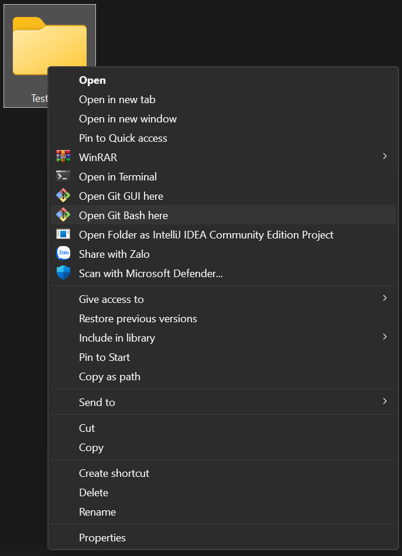
- 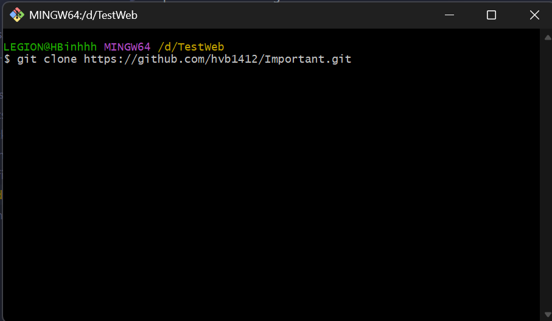
- 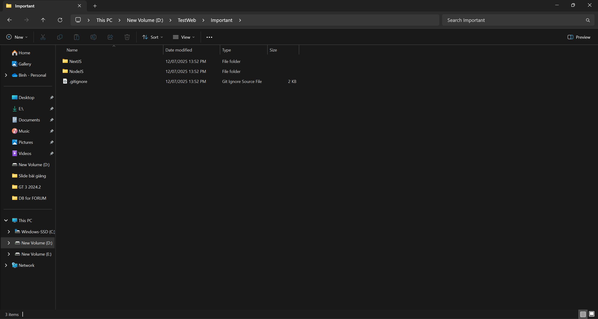
- 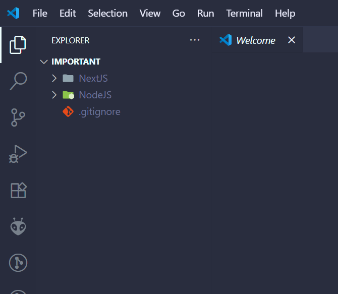
- 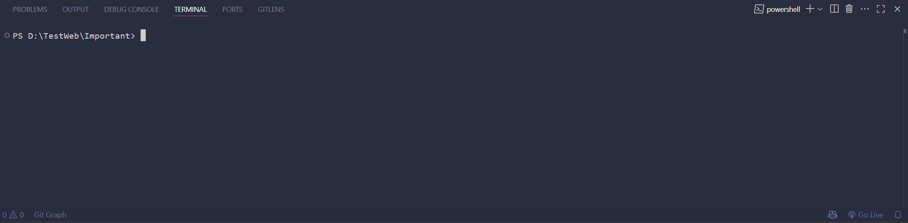

**Chú ý**: Nếu máy local chưa có NodeJS thì cần phải download NodeJS về máy và cài đặt NodeJS

### Cài đặt Frontend
- 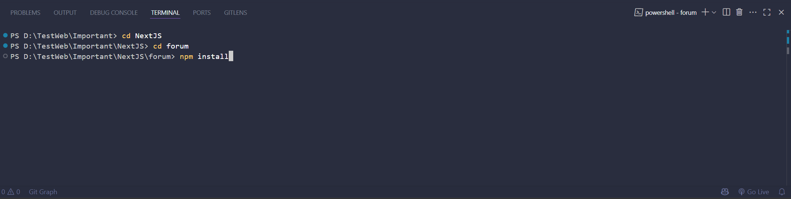
- 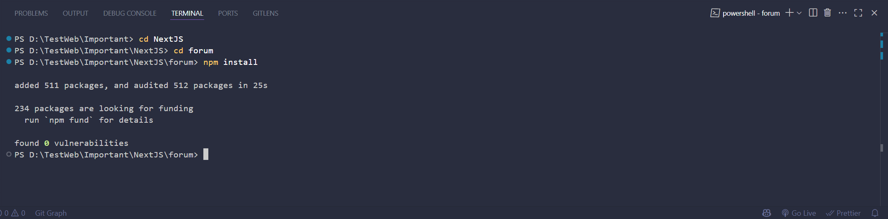
- 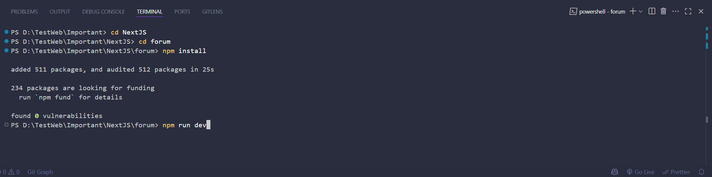
- 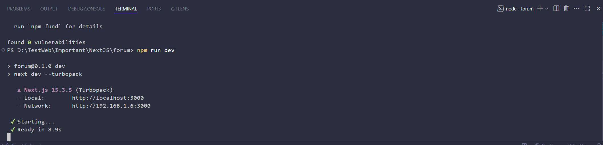

**Chú ý**: Trước khi truy cập vào trang web, chúng ta cần cài đặt Backend

### Cài đặt Backend
#### Restore Database
- 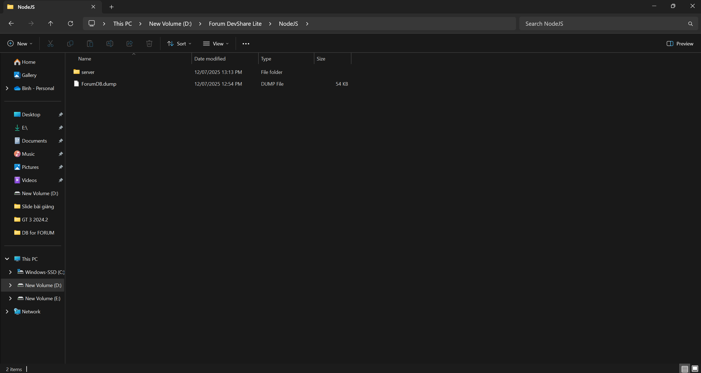
- Copy file ForumDB.dump ra bên ngoài 1 ổ đĩa nào đấy, ví dụ: ổ C, ổ D, ổ E... tùy thuộc vào máy tính local của người dùng
- 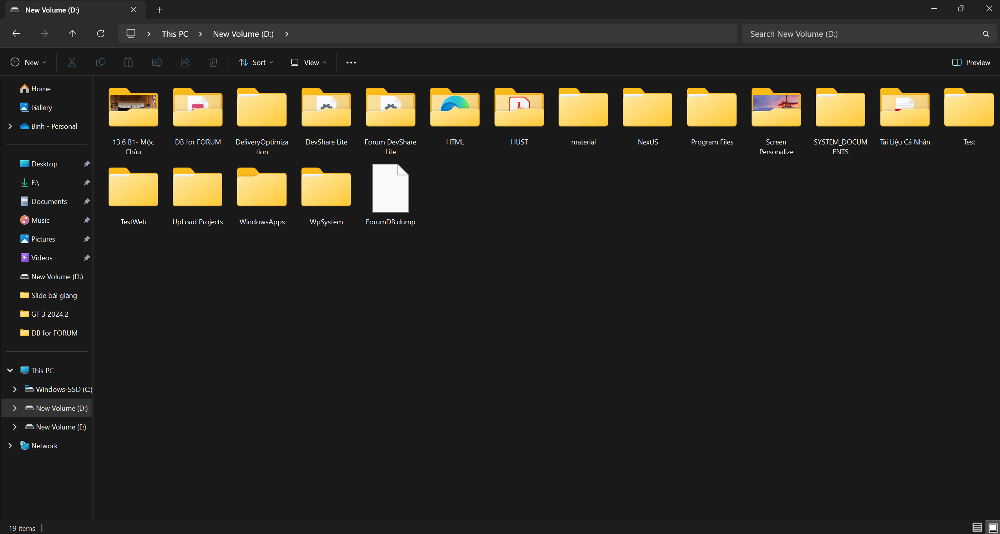
- Tiếp theo, chúng ta sẽ dùng Terminal của Window để restore database về PgAdmin4

**Chú ý**: Cần phải cài đặt PostgreSQL trước khi tiến hành restore

- Nếu người dùng đã cài đặt PostgreSQL, thì hãy làm theo các bước sau:
- 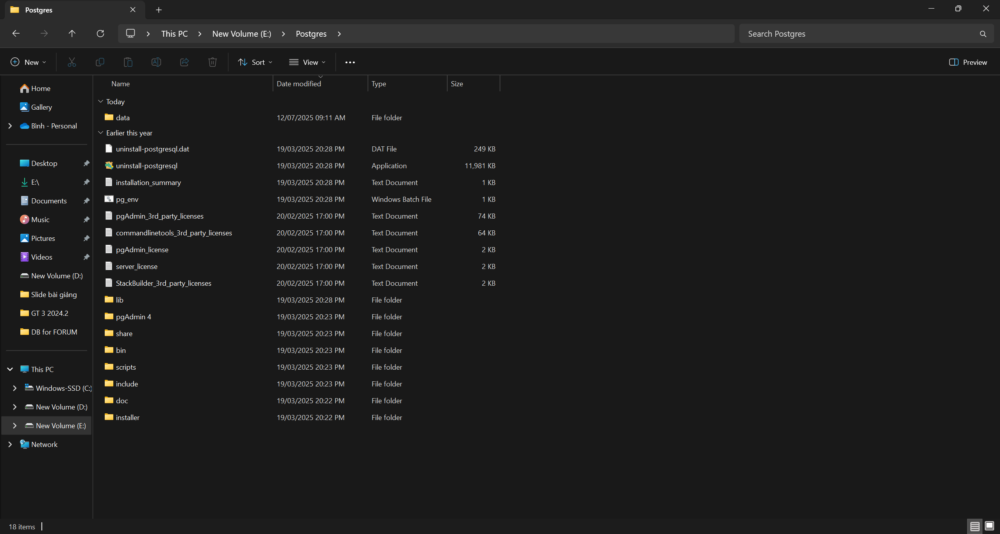
- Bên trong thư mục này, chúng ta sẽ thấy 1 thư mục con, có tên là "bin"
- 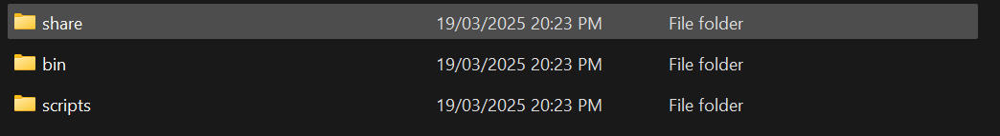
- 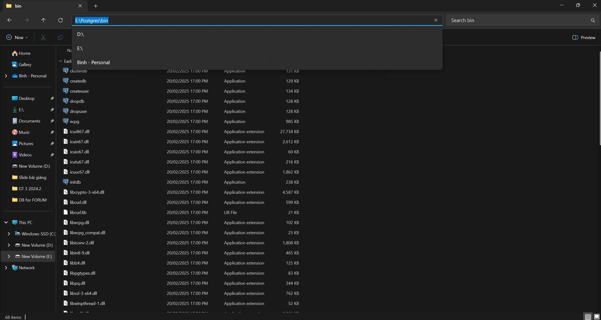
- 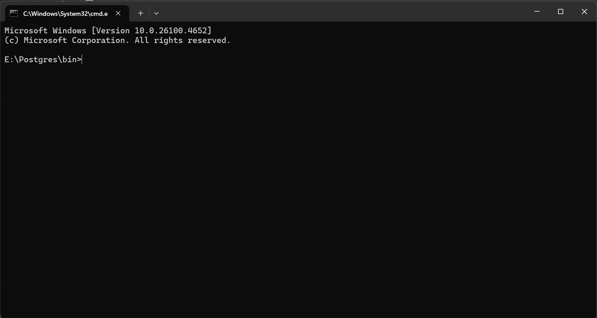
- Chúng ta cần tạo 1 database rỗng trong PostgreSQL trước khi restore dữ liệu của file "ForumDB.dmp" về máy
- Nhập câu lệnh: "psql postgres postgres" vào Terminal rồi Enter, nó sẽ yêu cầu nhập Password. Password này chính là password chúng ta đã tạo khi cài đặt PostgreSQL về máy

**Chú ý**: Trong quá trình nhập password, Terminal sẽ không hiển thị gì cả, người dùng chủ động nhập đúng password rồi nhấn Enter

- 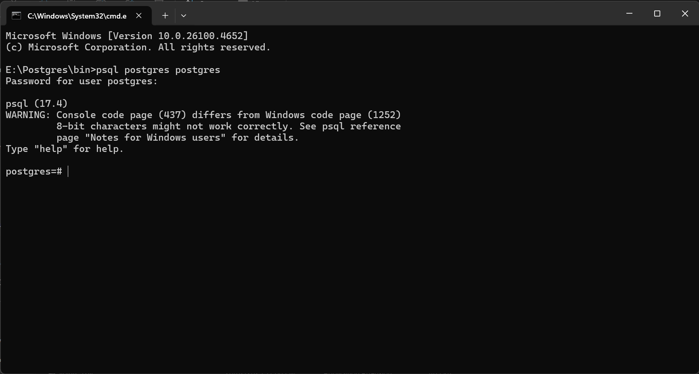
- Sử dụng câu lệnh: "CREATE DATABASE important;" để tạo 1 database rỗng (important là tên của database, bạn có thể đổi tên tùy theo bạn muốn)
- 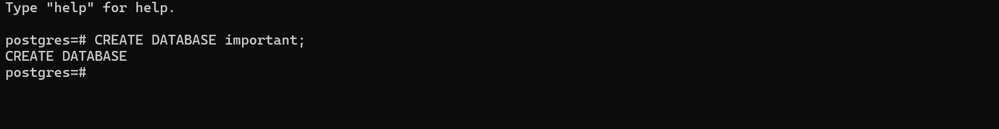
- 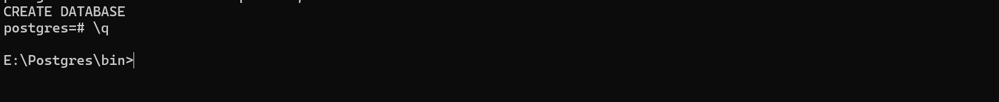
- Sử dụng câu lệnh sau để tiến hành restore dữ liệu từ file "ForumDB.dump": "pg_restore -d important -U postgres D:\ForumDB.dump"

**Chú ý**: 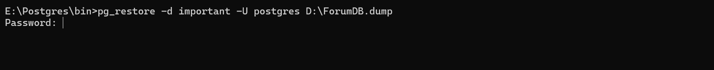
- Bạn cần nhập password 1 lần nữa rồi nhấn Enter
- 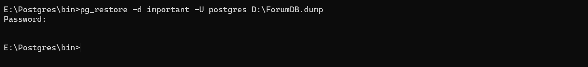
- Mở ứng dụng PgAdmin 4 lên và kiểm tra xem database bạn vừa tạo đã được restore dữ liệu thành công chưa
- 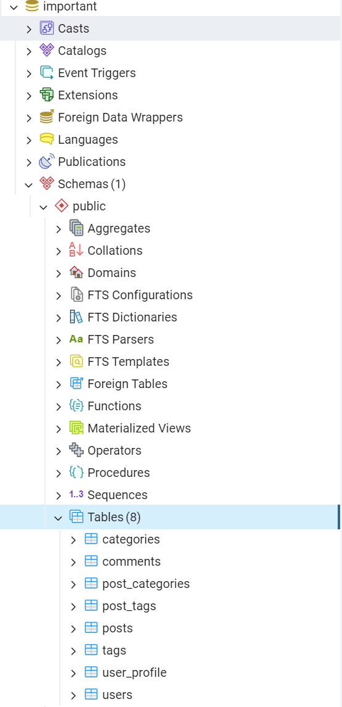

#### Khởi chạy Backend
- Tại thư mục NodeJS, nhấn mở thư mục server, sau đó mở thư mục postgres, ta sẽ thấy một file tên là: "postgres.js"
- 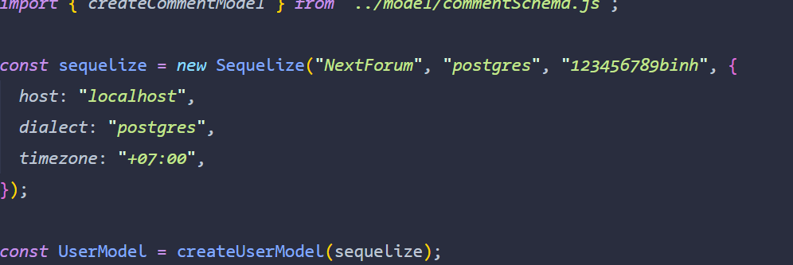

const sequelize = new Sequelize("NextForum", "postgres", "123456789binh", {
  host: "localhost",
  dialect: "postgres",
  timezone: "+07:00",
});

- Chúng ta sẽ sửa khu vực "NextForum" thành tên database mà bạn đã tạo, ở đây tôi đã tạo là "important", giữ nguyên phần "postgres", phần còn lại là mật khẩu PgAdmin 4 của bạn, thay thế nó. Ví dụ đoạn code sau thay thế:
const sequelize = new Sequelize("important", "postgres", "matkhauPgAdmin4", {
  host: "localhost",
  dialect: "postgres",
  timezone: "+07:00",
});

- Vậy là đã xong bước set up cho cơ sở dữ liệu

- 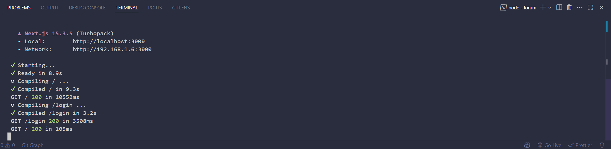
- 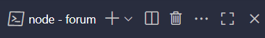
- 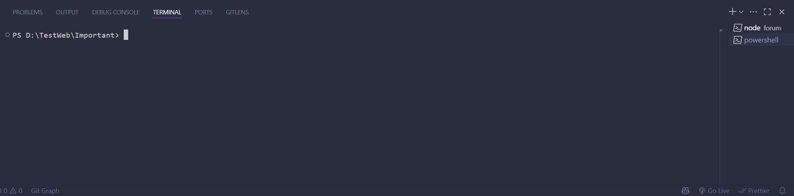
- 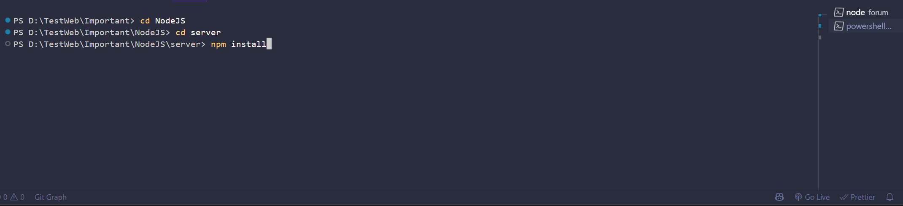
- 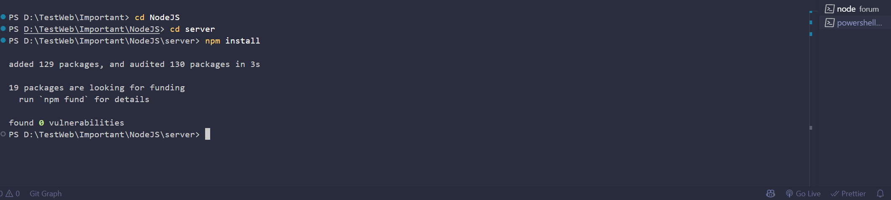
- Chạy câu lệnh "npm run start" để khởi chạy Backend
- 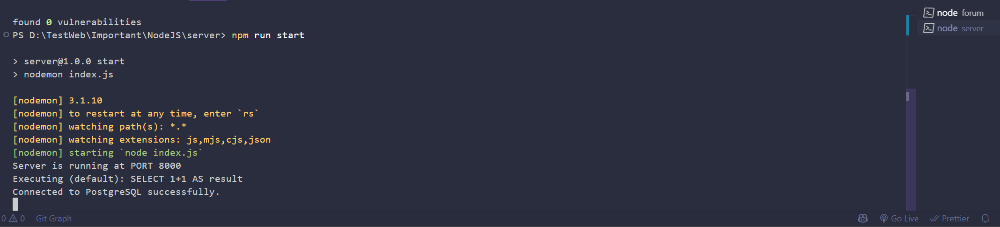

**Chú ý**: Nếu màn hình hiển thị sai khác, vui lòng thực hiện các bước lại từ đầu

- Sau khi khởi chạy Backend thành công, chúng ta có thể truy cập vào đường link của trang web: "http://localhost:3000"

**Chú ý**: Quá trình khởi chạy có thể sẽ tốn thời gian, vui lòng chờ đợi để trang load
- 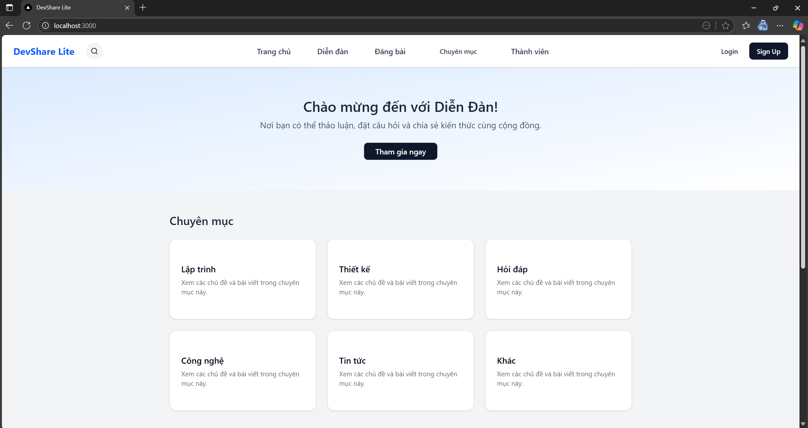

**Kết quả**: Chúng ta đã mở được trang web và có thể tiến hành các thao tác tại website này !!!!
