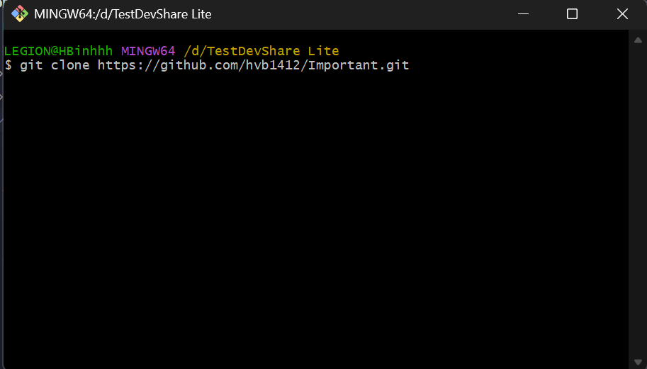

# DevShare Lite
## 📌 Author Information
👨‍🎓 **Full Name**: Hoàng Văn Bình
🎓 **School**: School of Information and Communication Technology, Hanoi University of Science and Technology
🆔 **Student ID**: 20235664

## 🧩 Project Overview
DevShare Lite is an online forum where users can post articles to share knowledge, learning materials, and real-world experiences during their studies or work. Users can also ask technical questions and engage in discussions through comments and replies.
This project simulates a small developer community where users can:
- Post content related to programming, technology, personal projects, news, study tips, or learning experiences;
- Tag and categorize posts for easy discovery and management;
- Read and comment on others’ posts, fostering academic interaction and discussion;
- Browse lists of trending, latest, or topic-specific posts.

The forum features a user-friendly and modern interface, tailored to younger users and optimized for easy navigation. User data is stored locally (via localStorage) after login, allowing a personalized experience without requiring complex registration steps.

Project Goal: To create an active learning environment that encourages IT students to share and learn from each other. It also helps them develop essential skills like article writing and clear knowledge presentation — both crucial for professional work settings.

## Main Features:
- User registration, login, and session storage using localStorage
- User profile view and edit
- View forum member list
- Create posts with tags and category classifications
- Browse posts by category or tag
- View featured and recent posts
- Search for posts by title or content
- Comment and reply under posts
- Responsive and modern UI, easy to use

## ⚙️ Technologies Used
### 🔷 Frontend
**Next.js**: React-based framework with server-side rendering (SSR), dynamic routing, and SEO optimization.
👉 *Why?* Improves page load speed, SEO-friendly, ideal for content-heavy apps like forums.

**Tailwind CSS**: Utility-first CSS framework for fast, flexible UI development.
👉 *Why?* Speeds up UI building, promotes reusability, and gives precise design control.

**Shadcn UI**: Modern UI component library with React components integrated with Tailwind.
👉 *Why?* Beautiful and customizable components, reduces frontend development time.

**React Markdown + remark-gfm**: Markdown rendering similar to GitHub, supporting tables, lists, checkboxes.
👉 *Why?* Enables intuitive writing using familiar markdown syntax.

**SCSS**: CSS preprocessor that supports nesting and variables for cleaner styles.
👉 *Why?* Improves code organization and makes UI scaling easier.

### 🔶 Backend
**Node.js & Express**: Platform for building server-side logic and RESTful APIs.
👉 *Why?* Clear structure, MVC-ready, strong community support.

**PostgreSQL**: Powerful relational database, suitable for related tables like users, posts, comments, etc.
👉 *Why?* Data has strong relations; PostgreSQL offers clear schema and efficient querying.

**Sequelize (ORM)**: ORM library to map tables into JavaScript models.
👉 *Why?* Reduces manual SQL, easier table relationship management, integrates well with PostgreSQL.

**pg (node-postgres)**: Core library to connect Node.js with PostgreSQL.
👉 *Why?* Powers Sequelize internally, ensuring performance and stability.

### 🛠️ Other Supporting Tools
**CORS**: Enables frontend to call backend APIs across different domains in development.
👉 *Why?* Required to link frontend (Next.js) and backend (Express) on different ports.

**Nodemon**: Automatically restarts the server on code changes.
👉 *Why?* Speeds up backend development.

## 🗂️ Project Folder Structure
### Frontend: NextJS/forum
src/
├── app/
│   ├── (auth)/                    # Handles login, registration
│   │   ├── components/            # Simple buttons, headers for auth
│   │   ├── login/                 # Login UI and logic
│   │   └── register/              # Registration UI and logic
│   ├── all-posts/                 # All post list
│   ├── category/[id]/             # Posts by category
│   ├── members/                   # Member list page
│   ├── post/
│   │   ├── [id]/                  # Post detail page
│   │   ├── components/            # Post components: post form, comments, author info, etc.
│   │   └── hooks/                 # Custom hooks for posts
│   ├── search/                    # Post search page
│   ├── user_profile/             # User profile and personal posts
│   ├── layout.tsx                # Default layout
│   ├── page.tsx                  # Homepage
│   └── globals.css               # Global CSS

├── components/                   # Reusable components: Header, SearchBar, theme
│   └── ui/                       # UI components: button, form, input, label, dialog...

├── lib/                          # Utility functions, shared config
├── config.ts                     # Global configuration
├── utils.ts                      # General utilities
├── next.config.ts                # Next.js configuration
├── package-lock.json             # Dependency lock file
├── package.json                  # Project dependencies & scripts
└── README.md                     # Frontend documentation

### Backend: NodeJS/server
source_code/backend/
├── controller/                   # Logic handlers for each module (user, post, comment...)
│   ├── categoryController.js
│   ├── commentController.js
│   ├── postController.js
│   ├── tagController.js
│   └── userController.js

├── model/                        # Database schemas (for Mongoose or other ORM)
│   ├── categorySchema.js
│   ├── commentSchema.js
│   ├── postCategorySchema.js
│   ├── postSchema.js
│   ├── postTagSchema.js
│   ├── tagSchema.js
│   ├── userProfileSchema.js
│   └── userSchema.js

├── postgres/                     # PostgreSQL connection and handling
│   └── postgres.js

├── view/                         # Backend API routes
│   └── routes.js

├── index.js                      # Main server entry point
├── package.json                  # Backend dependencies & scripts
├── package-lock.json             # Dependency lock file
└── node_modules/                 # Installed packages

---
## 🛠️ Installation & Project Setup
### Hướng dẫn cài đặt và khởi chạy dự án
- Clone the entire repository from: "https://github.com/hvb1412/Important.git"
- Create a new folder and open Git Bash inside it. 
- Run the command below to clone the repo: "git clone https://github.com/hvb1412/Important.git"  
- After that, we will have the folder: 
- Open the Important folder in VS Code, then open the terminal. 
- Terminal: 

**Note**: Make sure NodeJS is installed on your local machine.

### Frontend Setup
- Run the install commands shown in the image to install dependencies. 
- Installed successfully 
- Once dependencies are installed, run: "npm run dev" 
- The local link "http://localhost:3000" will be displayed in the terminal — this is the DevShare Lite website. 

**Important**: Set up the backend before visiting the site.

### Backend Setup
#### Restore Database
- In the source_code/backend folder, you will find a "ForumDB.dump" file. 
- Copy ForumDB.dump to a root directory (e.g., C:\, D:\ ).
- For example: 
- Next, we use Window Terminal to restore database into PgAdmin 4

**Note**: PostgreSQL must be installed beforehand.

- If PostgreSQL has installed, follow next steps:
- Open the folder where PostgreSQL has been installed 
- Inside, we will see a folder named "bin"
- Open folder "bin" 
- In the search bar, write "cmd" and enter 
- Result: 
- We need create a empty database before restoring datas from "ForumDB.dmp" file.
- Run the command: "psql postgres postgres" . Enter your PostgreSQL password when prompted.

**Note**: When you enter your password, Terminal doesn't show anything. Enter your password correctly and press enter

- If you success, you will have the screen: 
- Create a new empty database: "CREATE DATABASE important;" (important is the name of database, you can change it if you want)
- Result: 
- Exit with "\q" 
- Restore the database using: "pg_restore -d important -U postgres D:\ForumDB.dump"

**Note**: (Replace D:\ForumDB.dump and important with your actual file path and database name.) 

- Enter your password again to complete the restore.
- If you see like that on the screen, it's ok: 
- Open PgAdmin 4 to verify that the database was restored correctly.
- Result will like that: 

#### Backend Launch
- In backend folder, open the folder server, open folder postgres, you will see the file: "postgres.js"
- Inside the file "postgres.js", you will see the some codes like: 
- We need to update the codes:
const sequelize = new Sequelize("NextForum", "postgres", "123456789binh", {
  host: "localhost",
  dialect: "postgres",
  timezone: "+07:00",
});

- Update "NextForum" to database's name that you created, here I created with the name: "important", don't change "postgres", the last path is your password of PgAdmin 4, replace it. For example:
const sequelize = new Sequelize("important", "postgres", "passwordPgAdmin4", {
  host: "localhost",
  dialect: "postgres",
  timezone: "+07:00",
});

- That's all to restore database and we have done

- Back in the frontend terminal, open a second terminal tab for the backend. 
- Press + to open a second terminal 
- Now we have two screens, one for frontend, one for backend 
- Run the backend install commands. 
- Result: 
- Start the backend server using: "npm run start"
- If the terminal shows success messages, the backend is ready. 

**Note**: If errors occur, repeat the steps carefully.

- Once backend is running, visit: "http://localhost:3000" to see the website

**Node**: Wait for the initial load — compilation may take a few seconds.
- The Home Page of DevShare Lite 

🎉 **Result**: The DevShare Lite website is now live! You can begin using its features.

**Reminder**: The first-time load may take some time. Please be patient while the website compiles.
